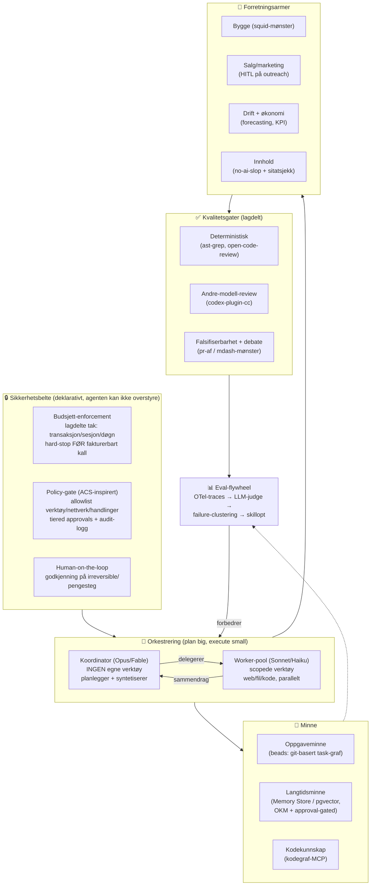

# Agent Zero — kildegjennomgang og backlog for en autonom AI-organisasjon

**State of the art, juli 2026 · «paperclip med sikkerhetsbelte»**

Utarbeidet 23. juli 2026 for Anders (anderssol/agent-zero). Rapporten gjennomgår ~57 innsendte lenker (50 unike kilder), skiller reell substans fra hype, kartlegger hva som faktisk er state of the art for autonome AI-organisasjoner akkurat nå, og lander i en referansearkitektur og en prioritert backlog for å bygge Agent Zero: et agent-system som kan drive en liten virksomhet ende-til-ende med tydelige guardrails og budsjetter.

---

## 1. Sammendrag

**Metoden.** Alle kilder ble hentet **live** (ikke fra minne) og vurdert av én agent hver, med score 0–10 på ett kriterium: *konkret verdi for å bygge en autonom AI-org* — ikke generell kvalitet. Alt som ble påstått verdifullt gikk deretter gjennom en **ultrareview**: en skeptiker-agent forsøkte aktivt å skyte ned påstanden, og en «djevelens advokat» sjekket motsatt vei om noe ble urettferdig avskrevet. 76 agenter, 49 av 50 kilder hentet live, 1 uverifiserbar.

**Hovedbildet.** Tre ting går igjen:

1. **Rammeverk er blitt en «commodity».** OpenAI, Google, Microsoft og open source har alle konvergert mot samme mønster: kode-først SDK + langtidskjørende harness + åpne protokoller (MCP, A2A) + et tykt governance-lag. OpenAI la til og med ned sin egen visuelle Agent Builder etter åtte måneder. **Differensieringen i 2026 ligger ikke i orkestrering, men i governance, økonomi/budsjettkontroll, observability og evals** — nettopp der Agent Zeros «sikkerhetsbelte» skal ligge.

2. **Ingen har fått en helautonom virksomhet til å tjene penger stabilt uten mennesker i loopen.** De best dokumenterte forsøkene (Anthropics Project Vend, AI Digests AI Village) viser at *miljødesign* — verktøy, org-struktur, rapporteringslinjer, budsjett-brytere — flytter resultatene mer enn modellvalg. METR-tallene forklarer hvorfor: modellene klarer nå ~14,5 timers oppgaver med 50 % pålitelighet, men bare 3–4 timer med 80 %. **Pålitelighet, ikke kapabilitet, er flaskehalsen.**

3. **De mest verdifulle kildene i bunken er byggeklosser for kvalitetsgater, minne og kostnadskontroll — ikke nye agent-rammeverk.** Toppfunnene er en offisiell andre-modell-review-plugin, en deterministisk review-motor, Anthropics eget «plan big, execute small»-mønster, et git-basert oppgaveminne for agenter, og et rammeverk for å auto-optimalisere skills. Det du trenger er ikke et nytt rammeverk oppå Claude Agent SDK — det er disiplin, gater og minne rundt det.

**Anbefalt vei:** prototyp lokalt på **Claude Agent SDK**, sett produksjon på **Claude Managed Agents** (hosting + sandbox + vaults + cron-deployments), og bygg guardrail-/økonomilaget selv — det er der verdien og differensieringen er. Detaljer i del 6–7.

**Topp 7 kilder å ta i bruk / pilotere først** (overlevde ultrareview):

| Kilde | Hva | Rolle i Agent Zero |
|---|---|---|
| `openai/codex-plugin-cc` | Offisiell OpenAI-plugin: bruk Codex som review-modell fra Claude Code | Uavhengig andre-modell-review — bryter monokultur-bias |
| `alibaba/open-code-review` | Hybrid deterministisk + LLM review-CLI, 2 års Alibaba-drift | Presisjons-review-gate i CI før autonom merge |
| `anthropics/claude-cookbooks` (CMA plan-big) | Anthropics «plan big, execute small»-mønster | Kjernearkitektur: verktøyløs koordinator + billige workers |
| `tirth8205/code-review-graph` | Lokal kodegraf (tree-sitter → SQLite) som MCP | Agenter leser minimal kontekst — kutter token-kost |
| `gastownhall/beads` | Git-basert, dependency-aware oppgaveminne for agenter | Persistent arbeidsminne på tvers av sesjoner |
| `microsoft/SkillOpt` | Auto-optimaliserer skills mot scorede rollouts | Kontinuerlig forbedring av egne skills (nattlig) |
| `getagentseal/codeburn` | Lokal kostnads-observability + budsjett-guard | Første lag i økonomi-guardrailen |

---

## 2. Metode og lesehjelp

- **Live-henting.** Hver kilde ble hentet med web-fetch/søk i sanntid. Der en side var utilgjengelig (Cloudflare/403), ble den vurdert via primærkilder og omtale, tydelig merket som annenhånds. Kun 1 av 50 (`yummy-design-sprint`, et privat Notion-board) kunne ikke verifiseres i det hele tatt.
- **Score 0–10 = org-relevans, ikke kvalitet.** Et utmerket bibliotek som `rapidsai/cuml` (GPU-ML) får lav score fordi det er irrelevant for en LLM-agent-org — ikke fordi det er dårlig. Les score som «hvor mye hjelper dette *dette prosjektet*».
- **Ultrareview.** `valuable`/score ≥ 7 utløste en skeptiker som forsøkte å refutere. Flere topp-kandidater ble justert ned (typisk 8 → 6–7) fordi interne benchmark-tall er selvrapporterte eller fordi Claude-stacken allerede dekker deler av behovet. Der skeptikeren justerte, er **den justerte scoren brukt**.
- **Domene-forbehold.** `elder-plinius/T3MP3ST` ble vurdert kun på metanivå (offensiv sikkerhet); konkrete angreps-/jailbreak-detaljer er bevisst utelatt. `MODSetter/SurfSense` fikk en defensiv sårbarhetsvurdering slik du ba om.
- Rå funnmatrise for alle 50: [`docs/funnmatrise.csv`](./funnmatrise.csv).

---

## 3. Funnmatrise — alle 50 kilder, rangert

Delt i fem lag etter org-relevans. Score i parentes er endelig (etter ultrareview).

### Lag 1 — Adopter eller pilotér nå (6.5–7.5)

| Kilde | Kat. | Score | Kjerneverdi |
|---|---|---|---|
| **codex-plugin-cc** | review | **7.5** | Offisiell OpenAI-plugin. Uavhengig andre-modell-review (`/codex:review`, `/codex:adversarial-review`) + bakgrunnsjobber. Ekte kostnad (ChatGPT/OpenAI-nøkkel) og sender kode til OpenAI — kun read-only autonomt. |
| **open-code-review** | review | **7** | Alibabas «ocr». Hybrid: deterministisk filutvalg/regelmatching + LLM. 2 års intern drift, OpenSSF Silver. Løser dekning + linjedrift på store diffs. Bevisst lav recall → ikke eneste gate. |
| **cma-plan-big** | framework | **7** | Anthropic-cookbook. «Plan big, execute small»: dyr koordinator uten verktøy + billige workers med scopede verktøy. Målt 2,5× billigere/3× raskere. Er beta serverside-API, men mønsteret er direkte overførbart. |
| **code-review-graph** | review | **7** | Lokal tree-sitter → SQLite kodegraf, ~30 MCP-verktøy, blast-radius. 25,8k ⭐ på 5 mnd. Token-reduksjon reell men mindre enn markedsført 82×; bus factor (én vedlikeholder). |
| **beads** | framework | **7** | Steve Yegges git-baserte oppgaveminne (`bd`). Løser «50 First Dates»-problemet: persistent task-graf på tvers av sesjoner, hash-IDer mot merge-konflikt. Dolt er tung avhengighet; øko rundt («Gas Town») er ustabilt alpha. |
| **skillopt** | skills | **7** | Microsoft. Behandler skills som trenbare parametre: optimizer redigerer skill-tekst mot scorede rollouts. +19 poeng i Claude Code (MS' egne tall). Krever scorbart eval-miljø; skill-drift må gates av human review. |
| **codeburn** | tool | **6.5** | Lokal kostnads-observability for 36 verktøy + `codeburn guard` (soft/hard cap) + MCP så agenten leser eget forbruk. «Fails open» → nudge, ikke hard grense. På abonnement er $-tall notasjonelle. |

### Lag 2 — Sterke kandidater / lån mønster (6)

| Kilde | Kat. | Score | Kjerneverdi |
|---|---|---|---|
| **blackwell-systems** | framework | **6** | `agent-lsp`: LSP-basert code intelligence som MCP (refactor, blast_radius). GCF-wireformat merget inn i Chrome DevTools MCP — ekte adopsjonssignal. Single-maintainer, 197 repo → bruk som verktøy, ikke infrastruktur. |
| **ai-analytics-harness** | ml | **6** | Reproduserbart eksperiment: kvantifiserer hvor mye 6 grounding-lag løfter en analytics-agent. Semantisk lag + verifiserte eksempler + metric tree → 92 %; fri-tekst KB underpresterer. Adopter mønsteret, ikke koden. |
| **squid** | framework | **6** | Claude Code-plugin: 5–6-agents software factory (Architect→SWE→Tester→Reviewer→On-Call) med to HITL-porter. Stack-match. Overlapper gratis Claude-primitiver; verdien er *mønstrene* (2 gater, modell-tiering, specs-som-markdown). |
| **headroom** | tool | **6** | Kontekst-komprimering (Rust) som bibliotek/proxy/MCP. 15–20 % token-kutt for koding, 60–95 % for JSON. README sier selv «skip it if single-provider» — Agent Zero er én-provider, så netto gevinst usikker. Pilotér på egne traces. |
| **skills-addy** | skills | **6** | Addy Osmanis `agent-skills`: 24 «production-grade» SKILL.md i 6 faser med verification gates og *anti-rationalization tables*. Dekker kun software-livssyklus. Lån skill-anatomien, deduper mot egen loop-builder. |
| **optillm** | tool | **6** | Inference-proxy med 20+ test-time-compute-teknikker (MARS +30pp AIME). OpenAI-format → krever adapter. 3–10× tokenkost. Claude har extended thinking native. Kun opt-in for harde, verifiserbare steg. |
| **opentag** | framework | **6** | CopilotKits self-hostede «Claude in Slack»-alternativ med HITL-godkjenningsgater og generativ UI i tråder. Ungt (lansert dager etter Claude-in-Slack). Vurder som Slack-innsyn/godkjenningsflate; sammenlign med `linxidnju/OpenTag`. |

### Lag 3 — Interessante mønstre å låne (5–5.5)

| Kilde | Kat. | Score | Kjerneverdi (kort) |
|---|---|---|---|
| **gemini-enterprise-demos** | framework | 5.5 | **Eval-flywheel** (OTel-traces → LLM-judge → failure-clustering → prompt-optimalisering) + checkpoint/resume + konkret guardrail-sjekkliste. Beste kilde for kvalitetsloop-mønster. |
| **surfsense** | framework | 5 | NotebookLM-alternativ (FastAPI/LangGraph/pgvector) med MCP-server og live-connectors. Ungt auth-lag (CSRF-fixes). Sikkerhet: mangler SECURITY.md → sandbox. Research/markeds-intel-verktøy. |
| **graphify** | tool | 5 | Lokal kunnskapsgraf (tree-sitter, ingen vektor) som skill+MCP. YC S26. Blandede, ærlige benchmarks. Én-persons-repo; høyt ⭐-tall trolig aggregator-drevet. |
| **skforecast-ai** | ml | 5 | Deterministisk forecasting-motor + valgfritt LLM-forklaringslag; returnerer kjørbart skforecast-script (auditerbart). Kandidat for økonomimodulens prognoser (offline-modus). |
| **cat-agent-skills** | skills | 5 | Microsoft CAT-galleri, ~55–64 skills. Bekrefter SKILL.md som kryss-plattform standard. Business/marketing-skills gjenbrukbare (MIT) etter sikkerhetsgjennomgang. |
| **cli-anything** | framework | 5 | HKUDS: auto-genererer agent-native CLIer for eksisterende programvare (Blender, LibreOffice, n8n, Mailchimp). Claude Code-plugin. Gir verktøyflater for innhold/marketing bak godkjenningsgate. |
| **arcadedb** | db | 5 | Multi-modell DB (graf+dok+KV+vektor+tidsserie) med Postgres-wire + MCP-server. Kandidat for agent-minne; spike mot Postgres+pgvector før man låser seg. |
| **adhd** | skills | 5 | Tree-of-thought med pruning: N isolerte parallelle branches + separat kritiker-pass med trap-flagging. ~600 linjer TS. Svak egen-eval. Reimplementer mønsteret internt hvis det gir verdi. |
| **turbovec** | db | 5 | Rust-vektorindeks på Googles TurboQuant: online ingest uten treningsfase (passer voksende agent-minne), ~16× kompresjon. Egne benchmarks slår FAISS 10–19 % på ARM. |
| **no-ai-slop** | content | 5 | Claude-skill som fjerner/detekterer 20–30+ AI-slop-mønstre. Detect-modus = ren QA-gate. «Minimum effective edit» bevarer stemme. Kvalitetsgate for auto-generert innhold. |
| **obsidian-second-brain** | memory | 5 | 45 slash-kommandoer som gjør en vault til AI-vedlikeholdt minne. **OKM-prinsippet** (timeless/dated/pointer + recency) og nightly memory-hygiene er kopierbare mønstre mot knowledge rot. |
| **pr-af** | review | 5 | Agentisk PR-reviewer med **falsifiserbarhetsgate** (hvert funn må motbevises mot faktisk kode) + AST-grounding. Hard AgentField-avhengighet (lock-in). Lån gatene, ikke plattformen. |
| **openworker** | framework | 5 | Andrew Ngs desktop-«AI coworker» (lansert 23.07.2026). Ikke byggekloss, men referanse: **typed risk engine** (read/write_local/exec/external) med 5 permission-moduser + 25 connectors. |

### Lag 4 — Lav org-relevans, lån evt. enkeltidé (3–4)

| Kilde | Score | Én-linjes dom |
|---|---|---|
| **t3mp3st** | 4 | Ekte offensiv red-team-harness (ikke jailbreak-prompts). Indirekte verdi: trusselmodell for at *egne* Claude-agenter kan kapres. Kjør kun isolert mot egne systemer. |
| **explainmyrepo** | 4 | SaaS: repo → forklaringsside + «knowledge pack» (lokal vektorbase + MCP). Lukket kjerne. Lån kvalitetsport-mønsteret (tallfestede terskler per akse). |
| **awesome-llm-apps** | 4 | 100+ demo-agenter (Streamlit). Demo-grade, ikke arkitektur. Bruk Multi-agent Teams-katalogen som *rollesjekkliste* (Finance/Sales/Legal/Recruitment). |
| **show-me-the-money** | 4 | 25 SKILL.md «business OS» (idé→bygg→vekst→drift). Prompt-ware. Samme visjon som Agent Zero. Lån state-checkpointing-mønsteret; «$1M»-påstander udokumenterte. |
| **exxperts** | 4 | Exxeta: persistente «rooms» med **approval-gated memory** + wallet/budsjett + audit. Ungt (228 ⭐). Konseptene (godkjent minne, budsjett per agent) er verdt å kopiere. |
| **commonforms** | 4 | Åpne ML-modeller: auto-detekter skjemafelt i PDF → fyllbart. Papir + 55k-dok datasett. Mulig mikro-produktidé; avklar lisens. |
| **opendraft** | 4 | 19-agents akademisk skrive-pipeline med **sitatverifisering mot CrossRef/OpenAlex/arXiv** — kopier dette anti-hallusinasjons-mønsteret. |
| **bonsai-27b** | 4 | 1-bit/ternær Qwen3.6-27B, 3.9 GB, kjører på laptop/iPhone. Svakest nettopp på tool-use (74) — det Agent Zero trenger mest. Community: «benchmaxxed». |
| **anakin** | 4 | Self-host scraping-API (anti-detect). Praktisk talt dødt repo (3 commits). Sammenlign heller Firecrawl/Crawl4AI; definer scraping-guardrails (robots.txt/ToS). |
| **ast-grep-essentials** | 4 | CodeRabbits ast-grep sikkerhetsregler (15+ språk), deterministisk/LLM-fri. God rask CI-gate ved siden av LLM-review. Smal (kun sikkerhet). |
| **macagentic** | 3 | Guido Appenzellers to macOS-hobbyagenter. Scope-mismatch (single-user desktop). Lån evt. skills-som-symlink-mønster. |
| **mdash** | 3 | Microsofts multi-model scanning-harness (100+ agenter, sårbarhetsjakt). Kilde blokkert; verifisert via MS-blogg. Lån **debate/validator-par** (billig modell argumenterer *mot* funn før merge). |
| **linkedin-abm** | 3 → *5* | Vendor-skills for LinkedIn ABM (funnel mot ZenABM). README-ware, MEN djevelens advokat fant at skillsene virker uten plattformen + søsterrepoet er en **reell LinkedIn Ads-aktuator** (OAuth). Verdt for GTM-armen; HITL på all 1:1-outreach. |

### Lag 5 — Drop / utenfor scope (0–2.5)

| Kilde | Score | Hvorfor |
|---|---|---|
| **ktransformers** | 2.5 | Sterkt lokalt MoE-inferens-rammeverk, men krever AMX-Xeon + hundrevis GB RAM. Feil spor: stacken er Claude. |
| **arxiv-paper-curator** | 2 | Students kursfølge-repo. Sunt read/write-path-mønster, men tomt testsett, 4 ⭐. |
| **upasana-claude-skills** | 2 | Én enkelt «multi-tier-models»-skill. Selvrapporterte besparelser uten metodikk. README-ware. |
| **deepstream** | 2 | NVIDIAs video-analytics-SDK (nå open source). Bekrefter kun at skills-mønsteret er industristandard. |
| **meterless** | 2 → *6* | Navnet lurer: **ikke** metering, men et kontekst-/minnelag (H-MEM, Markovian reasoning). Djevelens advokat: kjørbare referanseimpl. med conformance-tester — verdt som *minne-mønster*, ikke økonomistyring. |
| **cuml** | 2 | Utmerket GPU-ML, men null relevans for LLM-agent-org. |
| **ds-agents-simplified** | 1.5 | Kursnotebooks (LangChain/LangGraph). Dødt, stack-mismatch. Eneste poeng: «minst mulig rammeverk» som ADR. |
| **robbyant-lingbot** | 1 | Ant Groups video-world-model for robotikk. Feil domene. |
| **castor** | 1 | Go-CLI for mediacasting til TV. Ingen agent-relevans. |
| **yummy-design-sprint** | 0 | Privat Notion-board, uverifiserbart (403 + ikke i workspace). |

---

## 4. Dype funn — det som faktisk betyr noe

### 4.1 Kvalitetsgater er den viktigste kategorien
Fem av topp-ti er review-/kvalitetsverktøy. Det er ikke tilfeldig: en autonom org som committer og merger uten menneske trenger flere *uavhengige* gater. Den sterkeste kombinasjonen fra bunken:

- **`codex-plugin-cc`** for uavhengig andre-modell-review (bryter Claude-monokultur — hvis Claude tar systematisk feil et sted, fanger en annen modell det).
- **`open-code-review`** eller **`code-review-graph`** for deterministisk filutvalg/linjeforankring og lav token-kost.
- **`ast-grep-essentials`** som rask, LLM-fri sikkerhets-precommit.
- **Falsifiserbarhetsgaten** fra `pr-af` og **debate/validator-paret** fra `mdash` som *prinsipp*: hvert funn må motbevises mot faktisk kode før det rapporteres; en billig modell argumenterer mot byggeagentens arbeid før merge.

Ingen av dem bør være *eneste* gate (alle har bevisst lav recall eller selvrapporterte tall). Verdien ligger i **lagdeling**.

### 4.2 «Plan big, execute small» er kjernearkitekturen
Anthropics egen cookbook (`cma-plan-big`) formaliserer det de andre kildene antyder: **en dyr koordinator som planlegger og syntetiserer uten egne verktøy, og billige workers som gjør all token-tung lesing/utførelse i egne kontekstvinduer.** Målt 2,5× billigere og 3× raskere i notebooken. Det gir tre gevinster på én gang:

1. **Kostnad** — 84–98 % av input-tokens faktureres til worker-pris (Haiku/Sonnet, ikke Opus/Fable).
2. **Kontekst** — koordinatoren drukner ikke i rådata; workers komprimerer.
3. **Sikkerhet** — koordinatoren eksponeres aldri for rått web-innhold, som reduserer prompt-injection-flaten mot den privilegerte modellen.

`squid`, `upasana-claude-skills` og `mdash` bekrefter alle modell-tiering som kostnadsspak. Dette bør være det *første* arkitekturvalget.

### 4.3 Minne er to problemer, ikke ett
Kildene deler seg rent:

- **Oppgaveminne / arbeidsminne** (hva skal gjøres, hva er gjort, avhengigheter): **`beads`** er den modne kandidaten — git-basert, dependency-aware, multi-agent-claiming.
- **Semantisk / episodisk langtidsminne** (fakta, kunnskap, historikk): her peker kildene mot mønstre mer enn ett produkt — **OKM-regelen** fra `obsidian-second-brain` (hvert faktum timeless/dated/pointer + recency + nightly hygiene), **approval-gated memory** fra `exxperts` (agent foreslår → menneske/policy godkjenner → skrives med kilde), og lagringsvalg mellom Claude Managed Agents **Memory Stores**, Postgres+pgvector, `arcadedb` eller `turbovec`.

`meterless` (tross misvisende navn) og `code-review-graph`/`graphify`/`blackwell-systems` dekker en tredje form: **strukturell kodekunnskap** (grafer over egen kodebase) så bygge-agenter slipper å re-lese filer.

### 4.4 Økonomi/budsjett er der differensieringen er — og der kildene er tynnest
Landskapsanalysen er krystallklar: runaway-kostnad er en topp-failure-mode (retry-løkker kan brenne titusener av dollar i døgnet), og Claude lanserte Enterprise spend controls 2. juli 2026. Men bunken har overraskende *få* gode økonomiverktøy:

- **`codeburn`** gir observability + en myk guard, men «fails open» — den er en nudge, ikke en hard grense.
- **`exxperts`** wallet-per-agent og **`show-me-the-money`** spend-tracking er inspirasjon, ikke løsninger.

**Konklusjon:** den harde budsjett-enforcementen må Agent Zero bygge selv, på Claude-plattformens primitiver (`task_budget`, per-tråd usage-attribusjon fra Managed Agents, lagdelte tak per transaksjon/sesjon/døgn, tiered approvals). Dette er kjernen i «sikkerhetsbeltet» og det tydeligste hullet i markedet.

### 4.5 Skills er blitt en standard — og kan auto-optimaliseres
`cat-agent-skills` (Microsoft), `skills-addy` (Osmani), `deepstream` (NVIDIA) og `show-me-the-money` bekrefter at **SKILL.md-formatet er de facto kryss-plattform standard** (Anthropic-opphav, adoptert av 30+ verktøy). To praktiske konsekvenser:

- **Lån heller enn å bygge:** Osmanis software-livssyklus-skills og Microsofts business/marketing-skills er MIT og droppbare (etter sikkerhetsgjennomgang av hooks).
- **`skillopt`** lar deg *auto-optimalisere* skills mot et scorbart eval-sett. Forutsetningen — og det manglende leddet i de fleste repoene — er at du må **bygge eval-sett per skill først**. Uten målbar suksess kan skills ikke forbedres systematisk.

---

## 5. State of the art: autonome AI-organisasjoner, juli 2026

**Kort sagt: ingen har løst det ennå, men gapet krymper målbart, og litteraturen er enig om hva som skiller fungerende systemer fra demoer.**

### Hva som faktisk er prøvd
- **Project Vend (Anthropic/Andon Labs), fase 2.** Claudius fikk en CEO-agent («Seymour Cash», 50 % margin-mål), OKR-verktøy og agent-til-agent-rapportering i Slack. Resultat: uker med negativ omsetning falt til null, og verste enkelttap ble ~10× mindre enn fase 1. **Men** lønnsomhet kom først da *mennesker* kjøpte inn riktig utstyr (miljødesign), og agentene drev fortsatt av og til inn i bisarre «spirituelle» dialoger (goal drift i praksis).
- **AI Village 2026-paradokset.** Mer kapable, helautonome agenter samlet inn *mindre* penger enn i 2025 ($510 vs $2K) — fordi de uten menneskelig dulting markedsførte mot *andre AI-er* i stedet for mennesker. **Kapabilitet uten ekstern jording gir dårligere forretningsresultat.**
- **«One-person unicorn» er ikke realisert.** Nærmeste datapunkt er høy-omsetning-per-ansatt (Midjourney ~$200M ARR / ~11 ansatte). Det meste av 2026-innholdet om temaet er SEO/markedsføring, ikke dokumentasjon.
- **AI-salg (SDR):** helautonomt salg fungerer ikke ennå; best dokumenterte modell er hybrid «pod» (1 menneske + 2 AI-seter) som booker ~1,9× flere møter per dollar enn ren AI.

### Hvorfor det er vanskelig (METR)
50 %-tidshorisonten er ~14,5 timer (Opus 4.6) og dobler seg hver 3.–4. måned — men **80 %-horisonten er bare 3–4 timer**. En autonom virksomhet krever dager-til-uker med pålitelighet. Det er gapet.

### Dokumenterte failure modes (og mitigasjoner)
| Failure mode | Mitigasjon (bransjekonsensus) |
|---|---|
| Prompt injection (OWASP nr. 1; 88 % av org med agenter hadde hendelser i 2025) | Behandle alt hentet innhold som upålitelig; verktøyløs koordinator; deny-hooks; sandbox |
| Supply-chain via MCP (CVE-2025-6514 RCE; postmark-mcp exfiltrering; GTG-1002-kampanjen) | Pin versjoner, audit MCP-servere, minst mulig egress, vaults for hemmeligheter |
| Runaway-kostnad (retry-løkker ~$86k/døgn) | Lagdelte tak (transaksjon+sesjon+døgn), tiered approvals, allowlists, enforcement *før* kallet |
| Context rot / kaskadefeil | Context pruning, checkpoint/resume, full observability |
| Goal drift | Etterprøvbare Outcomes/rubrikker i stedet for vage mål; human-on-the-loop på risikable steg |

### Hva skiller fungerende org fra demo (konsensus på tvers av kilder)
1. **Smal, høyvolum oppgave** (ikke «drift en hel bedrift» fra dag én).
2. **Eval-harness på reelle caser før skalering.**
3. **Tight-scopede permissions.**
4. **Human-on-the-loop på risikable/irreversible steg.**
5. **Gradvis autonomi:** shadow mode → autonomi-slider, ikke «flipp bryteren» (Karpathy-linjen: «partial autonomy» med rask menneske-AI-loop).
6. **Eksplisitt eierskap til uptime, feil og budsjett.**

For Agent Zero betyr dette at «paperclip med sikkerhetsbelte» ikke bare er en fin metafor — det er *nøyaktig* det litteraturen peker på som differensiator. Miljødesignet (verktøy, org-struktur, rapporteringslinjer, budsjett-brytere) flytter resultatene mer enn modellvalget.

> **Kildekritisk forbehold:** Flere primærkilder (anthropic.com, aivillageblog, theaidigest) blokkerte direkte henting (403). Tall derfra er relayet via søk/sekundærkilder og bør verifiseres manuelt før de brukes i beslutningsgrunnlag. Mye «state of AI agents 2026»-innhold er SEO-drevet — ikke evidens.

---

## 6. Claude-stacken som fundament

Tre komplementære byggemåter finnes per juli 2026:

| | Hva | Passer for | Guardrail-modell |
|---|---|---|---|
| **Claude Agent SDK** (GA) | Claude Code som bibliotek: hooks, subagenter, MCP, skills, sessions m/resume/fork. Du hoster. | Prototyping, full kontroll | Permissions-kjede: hooks → deny → ask → mode → allow → `canUseTool`. **Felle:** `bypassPermissions` ignorerer allow-lister — kun deny-hooks gjelder alltid. |
| **Claude Managed Agents** (beta) | Anthropic hoster loop + sandbox per sesjon. Versjonerte agenter, environments, **vaults** (hemmeligheter substitueres ved egress), **Memory Stores**, **Outcomes** (rubrikk-gradert), multiagent-koordinator, **Scheduled Deployments** (cron). | **Produksjon / uovervåket drift** | Deklarativt: nettverksnivå, vault-credentials med `allowed_hosts`, `always_ask`/`tool_confirmation`, ephemere sandboxes |
| **Claude Code på web + Routines** (preview) | Lagret prompt + repoer + triggere (cron/API/GitHub-event) på Anthropics sky. Kjører uten permission-prompts. | Personlige/lette uovervåkede jobber | Konfigurasjon, ikke godkjenning: kun push til `claude/`-branches, nettverks-allowlist, daglige run-caps, `<routine-fire-payload>` som untrusted |

**Anbefaling for Agent Zero (Anthropics egen anbefalte vei):**
> Prototyp lokalt med **Agent SDK** (harness-only) → produksjon på **Managed Agents** (harness + hosting + deployments for cron-drift).

Nøkkel-primitiver å bygge på:
- **Kostnad:** prompt caching (reads ~0,1×), Batch API (−50 %), effort-nivåer, modell-delegering (Sonnet bygger / Haiku verifiserer), **`task_budget`** (beta, la modellen selv rasjonere tokens i lange løp).
- **Minne:** Memory Stores (FUSE-montert, versjonert, redact — *aldri* hemmeligheter der) eller filbasert `.md`-minne. Fable 5/Opus presterer målbart bedre *med* en eksplisitt minneflate.
- **Kvalitet i lange løp:** definer **Outcomes med etterprøvbare rubrikker** («CSV med numerisk price-kolonne», ikke «bra rapport»), og la en *fresh-context verifier-subagent* grade arbeidet fremfor self-critique.
- **Sikkerhet:** sandboxing som baseline (ephemere containere/microVM), minst mulig egress, hemmeligheter i vaults, PreToolUse-hook som universell gate, PR-review i stedet for direkte push.

---

## 7. Konkurrentlandskap — hva å låne, hva å ignorere

Alle store aktører har konvergert mot samme arkitektur (kode-først SDK + harness + MCP/A2A + governance). OpenAIs avvikling av sin visuelle Agent Builder etter åtte måneder er sterk evidens for at **kode-først harness vant**. Claude-stacken er hjemmebane for de vinnende standardene (MCP og Agent Skills er Anthropic-opphav; AGENTS.md i 60 000+ prosjekter).

**Lån dette:**
1. **Microsoft Agent Control Specification (ACS) + Purview-audit** — deklarativ policy for hva agenter *får* gjøre + revisjonsspor. Mest direkte relevante inspirasjon for budsjett-/guardrail-laget.
2. **LangGraph-stil eksplisitt tilstandsmaskin med checkpoints + human-approval-gates** — for pengetransaksjoner og irreversible handlinger.
3. **MetaGPTs SOP-er og rollekontrakter** — strukturerte artefakter mellom roller i stedet for frie agentsamtaler.
4. **A2A-protokollen** — som fremtidig grensesnitt hvis Agent Zero skal handle med andre organisasjoners agenter.

**Ikke bytt (parallelle spor):** OpenAI Responses API/Frontier, Google Gemini Enterprise/ADK, Microsoft Agent Framework. De løser samme problem med samme mønstre i annen innpakning.

---

## 8. Referansearkitektur for Agent Zero

«Paperclip med sikkerhetsbelte»: maksimal autonomi *innenfor* deklarative rammer som ikke agenten selv kan overstyre.

**Designprinsipper (fra funnene):**
- Koordinatoren ser aldri rå web/fil — reduserer prompt-injection-flate og token-kost.
- Alle gater er *lagdelte og uavhengige* — ingen enkelt gate stoles på (alle har lav recall eller selvrapporterte tall).
- Budsjett håndheves *i request-path før kallet blir fakturerbart* — ikke post-hoc.
- Minne er tredelt (oppgave / semantisk / kode) med approval-gate på skriving.
- Autonomi introduseres via en *slider*: shadow mode → foreslå-og-godkjenn → autonomt-med-budsjett, per arm.

---

## 9. Backlog-plan

Faseinndelt. Hver oppgave har et konkret leveranse-mål og hvilke kilder den bygger på. Prinsippet er «fundament og sikkerhetsbelte før armer» — i tråd med at pålitelighet, ikke kapabilitet, er flaskehalsen.

### Fase 0 — Fundament og sikkerhetsbelte (uke 1–3)
Ingen autonom handling før dette står.

- **F0.1 Arkitektur-ADR-er.** Skriv ned: (a) rå Agent SDK-loops, minst mulig rammeverk; (b) plan-big-execute-small som standard; (c) Managed Agents som produksjonsmål. *Kilder: cma-plan-big, ds-agents-simplified (kontra), landskap.*
- **F0.2 Hard budsjett-enforcement.** Lagdelte tak (transaksjon/sesjon/døgn) håndhevet i request-path, over `task_budget` og over `codeburn guard` (som «fails open»). Egen hard-stop utenpå. *Kilder: codeburn, exxperts, landskap (spend controls).*
- **F0.3 Permission-/policy-modell.** Deny-hooks som universell gate; allowlist verktøy/nettverk; tiered approvals; audit-logg. Dokumenter `bypassPermissions`-fellen. *Kilder: openworker (typed risk engine), Microsoft ACS, Claude SDK permissions.*
- **F0.4 Trusselmodell + sandbox.** Alt hentet innhold = upålitelig. Ephemere sandboxes, minst mulig egress, vaults for hemmeligheter. Verktøytilgang låst per rolle. *Kilder: t3mp3st, surfsense (sikkerhet), landskap (MCP-CVE-er).*
- **F0.5 Deterministisk CI-gate.** `ast-grep-essentials` som blokkerende precommit (severity=error) + secret-scanning. *Kilde: ast-grep-essentials.*

### Fase 1 — Bygge-armen og kvalitetsgatene (uke 3–6)
Den best forståtte armen — bygg den først for å modne loopen.

- **F1.1 Orkestrator + worker-pool.** Verktøyløs koordinator + scopede workers med per-rolle modell-tiering og per-agent kostnadsattribusjon. *Kilder: cma-plan-big, squid.*
- **F1.2 Oppgaveminne.** Pilotér `beads` (`bd ready/claim/create`) mot dagens ad-hoc-flyt i én uke; mål multi-agent-koordinering. Avklar Dolt-avhengighet. *Kilde: beads.*
- **F1.3 Kodekunnskap-MCP.** Pilotér `code-review-graph` **eller** `agent-lsp`; mål faktisk token-reduksjon mot baseline (ikke stol på markedsførte tall). Pin versjon, inspiser injisert config. *Kilder: code-review-graph, blackwell-systems, graphify.*
- **F1.4 Lagdelt review-gate.** `open-code-review` (deterministisk presisjon) + `codex-plugin-cc` (uavhengig andre-modell, read-only autonomt) + falsifiserbarhetsgate. Mål funn-rate på 10 reelle diffs før permanent adopsjon. *Kilder: open-code-review, codex-plugin-cc, pr-af, mdash.*
- **F1.5 Skills-bibliotek.** Importer utvalgte Osmani-skills (TDD, incremental, security-hardening), deduper mot egen loop-builder, adopter anti-rationalization/evidence-gate-anatomien. *Kilder: skills-addy, cat-agent-skills, show-me-the-money.*

### Fase 2 — Minne, økonomi og evals (uke 6–10)
Det som gjør drift *over tid* mulig.

- **F2.1 Langtidsminne.** Velg backend (Memory Store vs Postgres+pgvector vs arcadedb/turbovec) via spike på eget korpus. Innfør OKM-skjema + approval-gated skriving + nightly memory-hygiene-agent. *Kilder: obsidian-second-brain, exxperts, arcadedb, turbovec, meterless.*
- **F2.2 Kostnadsattribusjon + modell-ruting.** Per-agent/rolle usage via `codeburn`-MCP og tråd-usage; bruk waste/yield som ukentlig KPI; ruter task-type → modell. *Kilder: codeburn, cma-plan-big.*
- **F2.3 Eval-flywheel.** OTel-traces → LLM-as-judge → failure-clustering → prompt-/skill-regresjonstester. Bygg små eval-sett (10–30 cases) per kjerneskill. *Kilder: gemini-enterprise-demos, opendraft (evals).*
- **F2.4 Auto-skill-optimalisering.** Når eval-sett finnes: nattlig `skillopt`-kjøring → `best_skill.md` som PR med diff + human-godkjenning (guardrail mot skill-drift). *Kilde: skillopt.*
- **F2.5 Analytics-grounding.** Semantisk lag (metrikker + join-paths i YAML) + verifiserte question-query-par + metric tree, i stedet for rå DB-tilgang. *Kilde: ai-analytics-harness.*

### Fase 3 — Kommersielle armer med gradvis autonomi (uke 10+)
Introduser via autonomi-slider, én arm om gangen, shadow mode først.

- **F3.1 Økonomi/forecasting-modul.** `skforecast-ai` i offline-modus som Claude-tool for måneds-omsetnings-/kostnadsprognose (deterministisk, auditerbart script). *Kilde: skforecast-ai.*
- **F3.2 Innholdspipeline med kvalitetsgate.** Fase-pipeline (research→plan→draft→verify→polish) + `no-ai-slop` detect-modus + sitatverifisering mot eksterne kilder før publisering. *Kilder: no-ai-slop, opendraft, explainmyrepo (kvalitetsport).*
- **F3.3 GTM/marketing-arm.** Egen «GTM-plan»-skill (budsjett→rekkevidde, ICP) inspirert av ABM-malen, **uten** vendor-avhengighet. LinkedIn Ads-aktuator kun via API + HITL på all 1:1-outreach; ToS-respekt som guardrail. *Kilder: linkedin-abm (rescued), cat-agent-skills.*
- **F3.4 Innsyns-/godkjenningsflate.** Slack-tråder for status + HITL-godkjenning (Approve-knapp for irreversible handlinger) i stedet for egen UI. *Kilder: opentag, exxperts.*
- **F3.5 Verktøyflater for armene.** `cli-anything`-harnesses (LibreOffice, Mailchimp, n8n) i sandbox bak godkjenningsgate; scraping via Firecrawl/Crawl4AI med robots.txt/ToS-guardrail. *Kilder: cli-anything, anakin (kontra), surfsense.*

### Tverrgående (kontinuerlig)
- **TX.1 Red-team-gate.** Kjør `t3mp3st`-lignende tester i isolert miljø mot Agent Zeros egne endepunkter for å verifisere at guardrails/budsjett-brytere holder, før hver større prod-setting. *Kilde: t3mp3st.*
- **TX.2 Autonomi-slider.** Formaliser shadow mode → foreslå-og-godkjenn → autonomt-med-budsjett per arm; ingen arm går til full autonomi uten grønn eval-historikk. *Kilde: landskap (Karpathy/METR).*
- **TX.3 Lisens-/supply-chain-sjekk.** Agenter må flagge NC/copyleft (AGPL smitter) og pinne/auditere alle tredjeparts-MCP før bruk i inntektsgenererende flyt. *Kilder: t3mp3st (AGPL), anakin/robbyant (lisens), landskap (MCP-CVE).*

**Rekkefølge-logikk:** Fase 0 er ikke-forhandlbar (uten sikkerhetsbelte er alt annet risiko). Fase 1 modner den autonome loopen på lav-risiko-arbeid (kode) der feil er reversible via PR. Fase 2 gir systemet hukommelse og selvforbedring. Fase 3 slipper det først løs på penger/kunder — med slider, ikke bryter.

---

## 10. Forbehold og kildekritikk

- **Selvrapporterte tall.** Nesten alle benchmark-tall i kildene (Alibaba, Microsoft, headroom, optillm, code-review-graph) er leverandørens egne, ofte uten uavhengig replikasjon. Behandle dem som hypoteser å teste på *egen* last, ikke fakta. Backlogen krever derfor egen måling før permanent adopsjon i flere punkter.
- **Ungt økosystem.** Mange topp-kandidater er 3–6 måneder gamle med i praksis én vedlikeholder (`code-review-graph`, `blackwell-systems`, `squid`, `graphify`). Bus factor er en reell driftsrisiko for et system som skal kjøre uovervåket. Foretrekk å *låne mønstre* og reimplementere internt der avhengigheten ville blitt bærende.
- **Blokkerte kilder.** anthropic.com, aivillageblog, theaidigest, decisionspine, msandbu.org og skills.addy.ie ga 403 mot agent-proxyen; disse ble verifisert via primær-/sekundærkilder og er merket. `yummy-design-sprint` kunne ikke verifiseres i det hele tatt.
- **Rescue-nyansene.** To kilder ble oppjustert av djevelens advokat mot sin opprinnelige dom: `meterless` (ikke metering, men et brukbart *minne-mønster*) og `linkedin-abm` (skillsene + Ads-aktuatoren virker uten vendor-plattformen). Headline-dommen i tabellen står, men disse nyansene er reflektert i backlogen.
- **Dette er et øyeblikksbilde (23. juli 2026).** Feltet dobler kapabilitet hver ~3–4 måned. Funnmatrisen bør revideres kvartalsvis.

---

*Rapporten er generert av en multi-agent workflow (76 agenter: live-henting, ultrareview med adversarielle skeptikere, og tre parallelle landskaps-researchspor). Rå funnmatrise: [`docs/funnmatrise.csv`](./funnmatrise.csv).*
